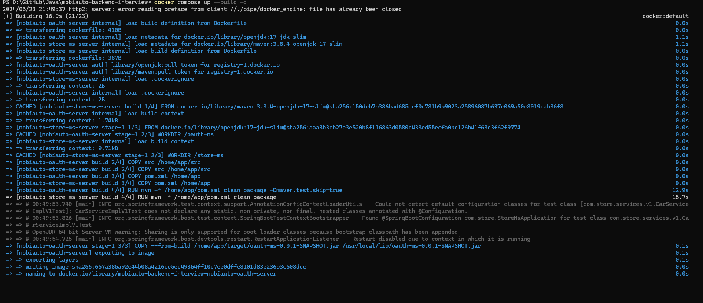
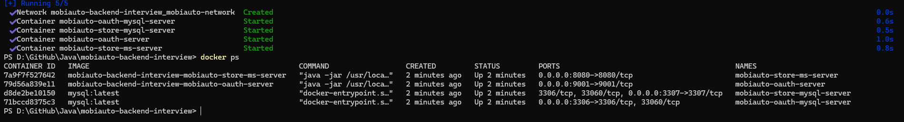
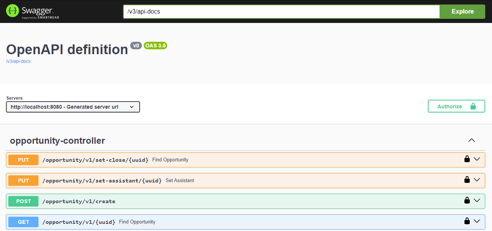
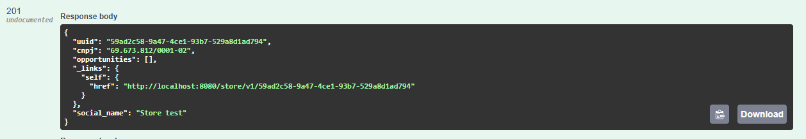
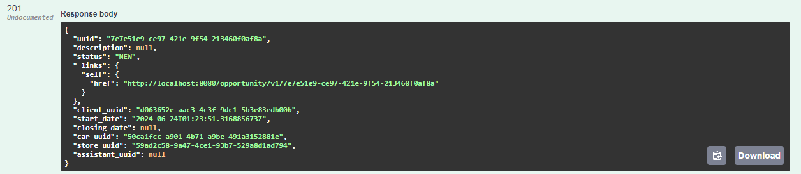
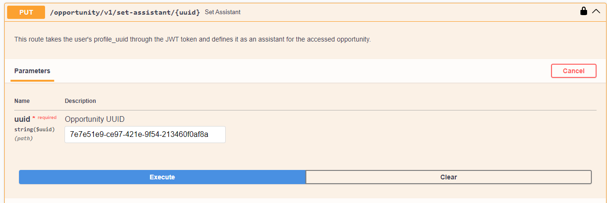

# Mobiauto Backend Interview


> Este projeto é uma API destinada a ser um sistema capaz de registrar lojas, ofertas e carros. Para isso, utilizei Java e Spring Boot, combinando soluções criativas e mantendo a arquitetura do projeto fortemente embasada nos princípios SOLID, com aplicação de design patterns para manter a aplicação concisa.

## Resumo da Arquitetura do Projeto:
<table>
  <tr>
    <td>Implementações</td>
    <td>Recursos</td>
    <td>Arquiteturas | Design Patterns</td>
  </tr>
  <tr>
    <td>CRUD para Lojas</td>
    <td>Spring Security</td>
    <td>Stateful oauth</td>
  </tr>
  <tr>
    <td>CRUD para Oportunidades</td>
    <td>Authorization Server Oauth2</td>
    <td>Microsserviços</td>
  </tr>
  <tr>
    <td>CRUD para Carros</td>
    <td>Resource Server Oauth2</td>
    <td>Builder</td>
  </tr>
  <tr>
    <td>Utilização de DTOS para entrada e saida de dados</td>
    <td>Hateos</td>
    <td>Factory</td>
  </tr>
  <tr>
    <td>Conteúdo da coluna 1</td>
    <td>Validation API</td>
    <td>Chain of Responsability para validações de campos</td>
  </tr>
  <tr>
    <td>Controle de acesso baseado em permissões</td>
    <td>Swagger-UI</td>
    <td>SOLID</td>
  </tr>
  <tr>
    <td>Implementação do Swagger utilizando Authorization Grant Flow with PKCE</td>
    <td>Spring Data JPA</td>
    <td>MCV</td>
  </tr>
  <tr>
    <td>Validação de CNPJ utilizando Bean Validation API</td>
    <td>MySQL</td>
    <td></td>
  </tr>
  <tr>
    <td>Validação de campos na criação de entidades JPA</td>
    <td>Docker</td>
    <td></td>
  </tr>
  <tr>
    <td>Definir assistante para uma Oportunidade</td>
    <td>Mockito</td>
    <td></td>
  </tr>
  <tr>
    <td>Fechar Oportunidade</td>
    <td>jUnit5</td>
    <td></td>
  </tr>
  <tr>
    <td>Retorno de um RepresentationModel Hateoas na criação das entidades JPA</td>
    <td></td>
    <td></td>
  </tr>
  <tr>
    <td>Paginação ao obter todos os objetos retornados do repositório</td>
    <td></td>
    <td></td>
  </tr>
  <tr>
    <td>Utilização de Mappers</td>
    <td></td>
    <td></td>
  </tr>
  <tr>
    <td>Versionamento da API</td>
    <td></td>
    <td></td>
  </tr>
  <tr>
    <td>jUnit Tests</td>
    <td></td>
    <td></td>
  </tr>
</table>

## 💻 Pré-requisitos

Antes de começar, verifique se você atendeu aos seguintes requisitos:

- Você instalou a versão mais recente do `<Docker>`.
- Versão <Strong>17</strong> do `<Java>`.
- `<Spring Tools Suite>` ou qualquer IDE de sua preferência.

## 🚀 Build

Para executar o build siga estas etapas:

Execute o próximo comando na raiz do projeto:

```
docker compose up --build -d
```




> Os testes criados com jUnit5 serão executados a partir do build da imagem do projeto.

## ☕ Usando a API

Para usar a API, siga estas etapas:

Acesse o Swagger (localhost:8080/swagger-ui/index.html):


Registre um carro:


Registre uma loja:


Registre uma oportunidade:


Caso a sua conta tenha uma permissão igual ou maior de um Assistente, registre sua conta como assistante da oportunidade:


Contas com diferentes permissões: 
<table>
    <tr>
        <td>Username</td>
        <td>Password</td>
    </tr>
    <tr>
        <td>emanuel</td>
        <td>123</td>
    </tr>
    <tr>
        <td>emanuel_assistant</td>
        <td>123</td>
    </tr>
    <tr>
        <td>emanuel_admin</td>
        <td>123</td>
    </tr>
    <tr>
        <td>emanuel_owner</td>
        <td>123</td>
    </tr>
</table>

## 📝 Observações

Esse projeto foi criado em tres dias referente a um teste para um vaga de Desenvolvedor Backend na Mobiauto. E poderá ser utilizado para fins de estudo para qualquer pessoa que tenha interesse sobre as implentações realizadas nesse projeto.
Esse projeto ainda não chegou na sua versão final, devido ao prazo de entrega do teste. Porém todas as tecnologias que descrevi estão devidamente implementadas.
